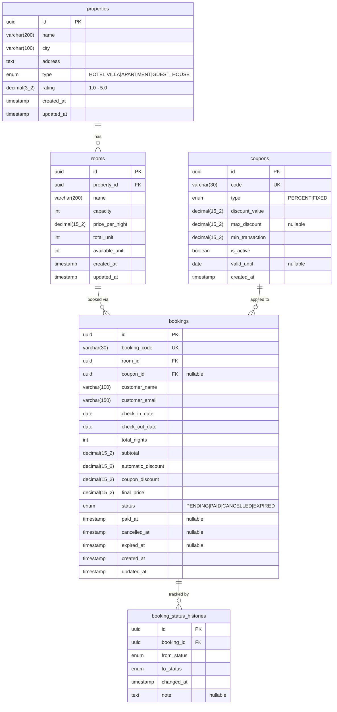

# Property Booking Platform — Backend API

A RESTful property booking management API built with **NestJS**, **TypeORM**, and **PostgreSQL**. This project implements property listings, room management, and a transactional booking system with coupon discounts, automatic expiry, and refund capabilities.

---

## Table of Contents

- [Tech Stack](#tech-stack)
- [Architecture Overview](#architecture-overview)
- [Project Structure](#project-structure)
- [Database Design](#database-design)
- [Design Decisions](#design-decisions)
- [Business Logic](#business-logic)
- [API Endpoints](#api-endpoints)
- [Getting Started](#getting-started)
- [Running Tests](#running-tests)
- [Sample Request & Response](#sample-request--response)
- [Submission Notes](#submission-notes)

---

## Tech Stack

| Technology | Version | Purpose |
|---|---|---|
| [NestJS](https://nestjs.com/) | v11.x | Backend framework |
| [TypeORM](https://typeorm.io/) | v0.3.x | ORM & database migrations |
| [PostgreSQL](https://www.postgresql.org/) | v16+ | Primary database |
| [TypeScript](https://www.typescriptlang.org/) | v5.x | Language (strict mode enabled) |
| [class-validator](https://github.com/typestack/class-validator) | v0.14 | DTO payload validation |
| [Swagger (OpenAPI)](https://swagger.io/) | v11.x | Interactive API documentation |
| [Decimal.js](https://mikemcl.github.io/decimal.js/) | v10.x | Monetary arithmetic safety |
| [date-fns](https://date-fns.org/) | v4.x | Timezone-safe date operations |
| [Jest](https://jestjs.io/) | v30.x | Unit testing framework |
| [Docker](https://www.docker.com/) | latest | Containerization |
| [Prettier](https://prettier.io/) + [ESLint](https://eslint.org/) | latest | Code formatting & linting |
| [Husky](https://typicode.github.io/husky/) + [lint-staged](https://github.com/lint-staged/lint-staged) | latest | Pre-commit hooks |

---

## Architecture Overview

The project follows a **Feature-Based Modular Architecture** — the standard recommended by NestJS for enterprise-grade applications. Each domain feature is self-contained in its own module directory with controllers, services, entities, and DTOs.

Key architectural patterns implemented:

- **Global Exception Filter** — Uniform error response format across all endpoints
- **Response Transform Interceptor** — Wraps all success responses in `{ success: true, data, meta }` format
- **Strategy Pattern** for Pricing — Automatic discount and coupon discount are isolated strategies applied sequentially
- **Pessimistic Write Locking** — Prevents race conditions on concurrent booking transactions
- **Cron-based Cleanup** — Scheduled job auto-expires stale `PENDING` bookings

---

## Project Structure

```
src/
├── common/                              # Shared infrastructure
│   ├── decorators/
│   │   └── is-after-date.decorator.ts   # Custom validator (checkOut > checkIn)
│   ├── filters/
│   │   └── all-exceptions.filter.ts     # Global HTTP exception handler
│   ├── helpers/
│   │   ├── booking-code.helper.ts       # Unique booking code generator
│   │   ├── decimal.transformer.ts       # TypeORM decimal column transformer
│   │   └── pagination.helper.ts         # Offset & cursor pagination utilities
│   └── interceptors/
│       └── transform.interceptor.ts     # Standardized response wrapper
├── config/
│   ├── app.config.ts                    # App-level configuration
│   ├── database.config.ts              # TypeORM connection config
│   └── env.validation.ts               # Joi-based env var validation
├── database/
│   ├── migrations/                      # TypeORM auto-generated migrations
│   └── seeds/
│       └── seed.ts                      # Initial data seeder
├── modules/
│   ├── bookings/                        # Booking domain
│   │   ├── dto/                         # CreateBookingDto, BookingResponseDto
│   │   ├── entities/                    # Booking, BookingStatusHistory
│   │   ├── enums/                       # BookingStatus enum
│   │   ├── services/
│   │   │   ├── bookings.service.ts      # Core transactional logic
│   │   │   └── pricing.service.ts       # Strategy-based pricing engine
│   │   └── bookings.controller.ts
│   ├── coupons/                         # Coupon domain
│   │   ├── entities/                    # Coupon entity
│   │   └── coupons.service.ts           # Coupon validation & lookup
│   ├── properties/                      # Property domain
│   │   ├── dto/                         # CreatePropertyDto, FilterPropertyDto
│   │   ├── entities/                    # Property entity
│   │   ├── properties.controller.ts
│   │   └── properties.service.ts        # Multi-filter query builder
│   └── rooms/                           # Room domain
│       ├── dto/                         # CreateRoomDto, RoomResponseDto
│       ├── entities/                    # Room entity
│       ├── rooms.controller.ts
│       └── rooms.service.ts
├── app.module.ts                        # Root module
└── main.ts                              # Entry point & Swagger setup
```

---

## Database Design

The system uses **5 tables** to manage the full booking lifecycle:



### Tables Added Beyond Minimum Specification

1. **`coupons`** — Designed as a master data table (not hardcoded in application logic). This allows dynamic coupon management: adding new coupons, deactivating existing ones, or setting expiration dates without code changes.

2. **`bookings`** — Stores all pricing calculation results (`subtotal`, `automatic_discount`, `coupon_discount`, `final_price`) as historical snapshots. This ensures audit trail consistency even if room prices or coupon rules change in the future.

3. **`booking_status_histories`** — Serves as an audit trail for booking status transitions (e.g., `PENDING` → `PAID`, `PENDING` → `EXPIRED`). Essential for internal audit tracking and debugging transaction issues.

---

## Design Decisions

### 1. UUID as Primary Key (vs. Auto-Increment)

All entities use `@PrimaryGeneratedColumn('uuid')`. This prevents **ID Enumeration Attacks** where external parties could sequentially scrape data (`/rooms/1`, `/rooms/2`, ...), hides internal business volume metrics from competitors, and ensures global uniqueness for future distributed system/microservice migrations.

### 2. Flat Customer Data in `bookings` Table (No `users` Table)

Customer identity (`customer_name`, `customer_email`) is stored directly in the `bookings` table rather than a separate `users` table. Per the technical specification, this system does not require user authentication or profile management. Embedding customer data directly provides simpler queries and eliminates unnecessary JOIN overhead.

### 3. Pessimistic Write Locking for Concurrency Control

The booking service uses `SELECT ... FOR UPDATE` (Pessimistic Write Locking) when creating bookings. This prevents race conditions where two simultaneous booking requests could both read `availableUnit = 1`, pass the availability check, and decrement the unit to `-1`:

```typescript
const room = await manager
  .createQueryBuilder(Room, 'room')
  .setLock('pessimistic_write')
  .where('room.id = :id', { id: roomId })
  .getOne();
```

### 4. Strategy Pattern for Pricing Engine

The pricing logic is isolated into a dedicated `PricingService` using the Strategy Pattern. Automatic discount (≥3 nights = 10% off) and coupon discount are applied as separate, composable strategies. All monetary calculations use `Decimal.js` to avoid IEEE 754 floating-point arithmetic bugs.

### 5. Migration-Driven Schema (No `synchronize: true`)

Database schema changes are managed exclusively through TypeORM CLI-generated migrations. We never use `synchronize: true` to avoid accidental data loss in production environments. Each migration is version-controlled and can be rolled back.

### 6. Strategic Database Indexing

Indexes are placed on frequently queried columns to optimize performance:

| Table | Index | Purpose |
|---|---|---|
| `properties` | `(city, type)` | Composite filter optimization |
| `properties` | `(rating)` | Sort/filter by rating |
| `rooms` | `(property_id)` | Foreign key join speed |
| `rooms` | `(price_per_night)`, `(capacity)` | Range filter optimization |
| `bookings` | `(booking_code)` UNIQUE | Fast lookup by booking code |
| `bookings` | `(room_id, status)` | Availability subquery |
| `bookings` | `(status, expired_at)` | Cron job expiry efficiency |
| `bookings` | `(customer_email)` | Customer lookup |

### 7. Offset vs Cursor-based Pagination

Both pagination strategies are supported on `GET /properties`:

| Aspect | Offset (`page` & `limit`) | Cursor (`cursor` & `limit`) |
|---|---|---|
| **Large-scale Performance** | Slow on later pages (DB scans all preceding rows) | Always fast (directly jumps to `WHERE id > cursor`) |
| **Data Consistency** | Prone to duplicates/gaps on real-time inserts | Consistent for infinite scroll feeds |
| **Random Navigation** | Can jump to any page | Sequential only (Next/Previous) |

---

## Business Logic

### Booking Transaction Flow

```
[Customer Request] → Validate Room Exists → Lock Room Row (SELECT FOR UPDATE)
    → Check available_unit > 0 → Calculate Pricing → Apply Coupon (optional)
    → Decrement available_unit → Create Booking (PENDING) → Set expiry (1 hour)
    → Return booking with pricing breakdown
```

### Pricing Calculation Rules

1. **Subtotal**: `price_per_night × total_nights`
2. **Automatic Discount**: If `total_nights ≥ 3`, 10% discount from subtotal
3. **Subtotal After Auto Discount**: `subtotal - automatic_discount`
4. **Coupon Discount**: Validated against subtotal after auto discount
   - `min_transaction` check against this amount
   - `PERCENT` type: calculated from this amount, capped by `max_discount`
   - `FIXED` type: flat discount applied directly
5. **Final Price**: `subtotal - automatic_discount - coupon_discount` (minimum 0)

### Available Coupons

| Code | Type | Discount | Max Discount | Min Transaction |
|---|---|---|---|---|
| `NEWUSER10` | PERCENT | 10% | Rp 100.000 | Rp 500.000 |
| `STAYCATION50` | FIXED | Rp 50.000 | — | Rp 300.000 |

### Booking Status Lifecycle

```
PENDING ──→ PAID ──→ CANCELLED (via /refund)
   │
   ├──→ CANCELLED (via /cancel, restores room unit)
   │
   └──→ EXPIRED (auto, via cron job after 1 hour, restores room unit)
```

---

## API Endpoints

| Method | Endpoint | Description |
|---|---|---|
| `POST` | `/api/properties` | Create a new property |
| `GET` | `/api/properties` | List properties with multi-filter & pagination |
| `GET` | `/api/properties/:id` | Get property detail with available rooms |
| `POST` | `/api/properties/:propertyId/rooms` | Create a room for a property |
| `GET` | `/api/properties/:propertyId/rooms` | List rooms of a property |
| `POST` | `/api/bookings` | Create a booking transaction |
| `PATCH` | `/api/bookings/:id/pay` | Mark booking as PAID |
| `PATCH` | `/api/bookings/:id/cancel` | Cancel PENDING booking (restores room unit) |
| `PATCH` | `/api/bookings/:id/refund` | Refund PAID booking (restores room unit) |

### Property Listing Filters

| Query Param | Type | Example | Description |
|---|---|---|---|
| `city` | string | `Jakarta` | Filter by city name |
| `type` | enum | `HOTEL` | Filter by property type |
| `minRating` | number | `4.0` | Minimum rating |
| `maxPrice` | number | `600000` | Maximum room price per night |
| `minCapacity` | number | `4` | Minimum room capacity |
| `checkInDate` | date | `2026-07-20` | Check-in date availability |
| `checkOutDate` | date | `2026-07-22` | Check-out date availability |
| `page` | number | `1` | Page number (offset pagination) |
| `limit` | number | `10` | Items per page |
| `cursor` | string | `base64...` | Cursor for cursor-based pagination |

> **Interactive API Documentation**: Access Swagger UI at `http://localhost:3000/api/docs`

---

## Getting Started

### Prerequisites

- Node.js v18+
- PostgreSQL 14+ (or Docker)
- npm v9+

### Using Docker (Recommended)

```bash
# 1. Clone and configure environment
cp .env.example .env

# 2. Start containers (PostgreSQL + API)
docker compose up -d

# 3. Run migrations & seed data
docker compose exec api npm run migration:run
docker compose exec api npm run seed

# 4. Access the API
# API:     http://localhost:3000/api
# Swagger: http://localhost:3000/api/docs
```

### Using Local Environment

```bash
# 1. Install dependencies
npm install

# 2. Configure PostgreSQL connection in .env

# 3. Run migrations & seed
npm run migration:run
npm run seed

# 4. Start development server
npm run start:dev
```

---

## Running Tests

```bash
# Unit tests
npm run test

# Watch mode
npm run test:watch

# Coverage report
npm run test:cov

# E2E tests
npm run test:e2e
```

### Test Coverage

| Test Suite | Tests | Description |
|---|---|---|
| `pricing.service.spec.ts` | 7 | Pricing calculation, auto discount, coupon logic, edge cases |
| `properties.service.spec.ts` | 2 | Property creation, query builder mock |
| `app.controller.spec.ts` | 1 | Health check |

---

## Sample Request & Response

Below are payload examples of HTTP requests and responses for the application's main flows. Note that all responses are wrapped in a standard structure `{ "success": true, "data": ... }` by the global transform interceptor.

---

### 1. Create Property

- **Endpoint**: `POST /api/properties`
- **Request Body**:
```json
{
  "name": "Hotel Grand Indonesia",
  "city": "Jakarta",
  "address": "Jl. M.H. Thamrin No.1, Jakarta Pusat",
  "type": "HOTEL",
  "rating": 4.5
}
```
- **Response (201 Created)**:
```json
{
  "success": true,
  "data": {
    "id": "982785f1-bfba-4adb-99ba-4379a438d832",
    "name": "Hotel Grand Indonesia",
    "city": "Jakarta",
    "address": "Jl. M.H. Thamrin No.1, Jakarta Pusat",
    "type": "HOTEL",
    "rating": 4.5
  }
}
```

---

### 2. Create Room (Linked to Property)

- **Endpoint**: `POST /api/properties/:propertyId/rooms`
- **Request Body**:
```json
{
  "name": "Deluxe Room",
  "capacity": 2,
  "pricePerNight": 500000,
  "totalUnit": 10,
  "availableUnit": 10
}
```
- **Response (201 Created)**:
```json
{
  "success": true,
  "data": {
    "id": "a1b2c3d4-e5f6-7890-abcd-ef1234567890",
    "propertyId": "982785f1-bfba-4adb-99ba-4379a438d832",
    "name": "Deluxe Room",
    "capacity": 2,
    "pricePerNight": 500000,
    "totalUnit": 10,
    "availableUnit": 10
  }
}
```

---

### 3. Get Properties (With Filters & Pagination)

- **Endpoint**: `GET /api/properties?city=Jakarta&minRating=4.0&limit=10&page=1`
- **Response (200 OK)**:
```json
{
  "success": true,
  "data": {
    "data": [
      {
        "id": "982785f1-bfba-4adb-99ba-4379a438d832",
        "name": "Hotel Grand Indonesia",
        "city": "Jakarta",
        "address": "Jl. M.H. Thamrin No.1, Jakarta Pusat",
        "type": "HOTEL",
        "rating": 4.5,
        "rooms": [
          {
            "id": "a1b2c3d4-e5f6-7890-abcd-ef1234567890",
            "name": "Deluxe Room",
            "capacity": 2,
            "pricePerNight": 500000,
            "totalUnit": 10,
            "availableUnit": 10
          }
        ]
      }
    ],
    "meta": {
      "total": 1,
      "page": 1,
      "limit": 10,
      "totalPages": 1
    }
  }
}
```

---

### 4. Get Property Detail (With Rooms list)

- **Endpoint**: `GET /api/properties/982785f1-bfba-4adb-99ba-4379a438d832`
- **Response (200 OK)**:
```json
{
  "success": true,
  "data": {
    "id": "982785f1-bfba-4adb-99ba-4379a438d832",
    "name": "Hotel Grand Indonesia",
    "city": "Jakarta",
    "address": "Jl. M.H. Thamrin No.1, Jakarta Pusat",
    "type": "HOTEL",
    "rating": 4.5,
    "rooms": [
      {
        "id": "a1b2c3d4-e5f6-7890-abcd-ef1234567890",
        "name": "Deluxe Room",
        "capacity": 2,
        "pricePerNight": 500000,
        "totalUnit": 10,
        "availableUnit": 10
      }
    ]
  }
}
```

---

### 5. Get Rooms of a Property

- **Endpoint**: `GET /api/properties/982785f1-bfba-4adb-99ba-4379a438d832/rooms`
- **Response (200 OK)**:
```json
{
  "success": true,
  "data": [
    {
      "id": "a1b2c3d4-e5f6-7890-abcd-ef1234567890",
      "propertyId": "982785f1-bfba-4adb-99ba-4379a438d832",
      "name": "Deluxe Room",
      "capacity": 2,
      "pricePerNight": 500000,
      "totalUnit": 10,
      "availableUnit": 10
    }
  ]
}
```

---

### 6. Create Booking (With Auto-Discount & Coupon)

- **Endpoint**: `POST /api/bookings`
- **Request Body**:
```json
{
  "customerName": "John Doe",
  "customerEmail": "john.doe@example.com",
  "roomId": "a1b2c3d4-e5f6-7890-abcd-ef1234567890",
  "checkInDate": "2026-07-20",
  "checkOutDate": "2026-07-23",
  "couponCode": "NEWUSER10"
}
```
- **Response (201 Created)**:
- _Note: 3 nights stay triggers a 10% auto-discount. The coupon NEWUSER10 (10% up to Rp 100k) is applied afterward._
```json
{
  "success": true,
  "data": {
    "id": "f47ac10b-58cc-4372-a567-0e02b2c3d479",
    "bookingCode": "BK-20260720-A1B2C3D4",
    "roomId": "a1b2c3d4-e5f6-7890-abcd-ef1234567890",
    "couponId": "d4e5f6a7-b8c9-0123-def0-1234567890ab",
    "customerName": "John Doe",
    "customerEmail": "john.doe@example.com",
    "checkInDate": "2026-07-20",
    "checkOutDate": "2026-07-23",
    "totalNights": 3,
    "subtotal": 1500000,
    "automaticDiscount": 150000,
    "couponDiscount": 100000,
    "finalPrice": 1250000,
    "status": "PENDING",
    "createdAt": "2026-07-17T14:30:00.000Z"
  }
}
```
> **Pricing Breakdown:**
> - Subtotal: 500,000 × 3 nights = **1,500,000**
> - Auto discount (≥3 nights → 10%): **150,000**
> - After auto discount: **1,350,000**
> - NEWUSER10 (10% of 1,350,000 = 135,000, max 100k): capped at **100,000**
> - Final Price: 1,350,000 − 100,000 = **1,250,000**

---

### 7. Pay Booking

- **Endpoint**: `PATCH /api/bookings/f47ac10b-58cc-4372-a567-0e02b2c3d479/pay`
- **Response (200 OK)**:
```json
{
  "success": true,
  "data": {
    "id": "f47ac10b-58cc-4372-a567-0e02b2c3d479",
    "bookingCode": "BK-20260720-A1B2C3D4",
    "roomId": "a1b2c3d4-e5f6-7890-abcd-ef1234567890",
    "couponId": "d4e5f6a7-b8c9-0123-def0-1234567890ab",
    "customerName": "John Doe",
    "customerEmail": "john.doe@example.com",
    "checkInDate": "2026-07-20",
    "checkOutDate": "2026-07-23",
    "totalNights": 3,
    "subtotal": 1500000,
    "automaticDiscount": 150000,
    "couponDiscount": 100000,
    "finalPrice": 1250000,
    "status": "PAID",
    "createdAt": "2026-07-17T14:30:00.000Z"
  }
}
```

---

### 8. Cancel Booking (Restores Room Unit)

- **Endpoint**: `PATCH /api/bookings/f47ac10b-58cc-4372-a567-0e02b2c3d479/cancel`
- **Response (200 OK)**:
```json
{
  "success": true,
  "data": {
    "id": "f47ac10b-58cc-4372-a567-0e02b2c3d479",
    "bookingCode": "BK-20260720-A1B2C3D4",
    "roomId": "a1b2c3d4-e5f6-7890-abcd-ef1234567890",
    "couponId": "d4e5f6a7-b8c9-0123-def0-1234567890ab",
    "customerName": "John Doe",
    "customerEmail": "john.doe@example.com",
    "checkInDate": "2026-07-20",
    "checkOutDate": "2026-07-23",
    "totalNights": 3,
    "subtotal": 1500000,
    "automaticDiscount": 150000,
    "couponDiscount": 100000,
    "finalPrice": 1250000,
    "status": "CANCELLED",
    "createdAt": "2026-07-17T14:30:00.000Z"
  }
}
```

---

### 9. Refund Booking (Bonus Admin Flow)

- **Endpoint**: `PATCH /api/bookings/f47ac10b-58cc-4372-a567-0e02b2c3d479/refund`
- **Response (200 OK)**:
```json
{
  "success": true,
  "data": {
    "id": "f47ac10b-58cc-4372-a567-0e02b2c3d479",
    "bookingCode": "BK-20260720-A1B2C3D4",
    "roomId": "a1b2c3d4-e5f6-7890-abcd-ef1234567890",
    "couponId": "d4e5f6a7-b8c9-0123-def0-1234567890ab",
    "customerName": "John Doe",
    "customerEmail": "john.doe@example.com",
    "checkInDate": "2026-07-20",
    "checkOutDate": "2026-07-23",
    "totalNights": 3,
    "subtotal": 1500000,
    "automaticDiscount": 150000,
    "couponDiscount": 100000,
    "finalPrice": 1250000,
    "status": "CANCELLED",
    "createdAt": "2026-07-17T14:30:00.000Z"
  }
}
```

---

### 10. Error Responses

**Overbooking — No Available Units (409 Conflict):**
```json
{
  "success": false,
  "statusCode": 409,
  "message": "No available units for this room type",
  "timestamp": "2026-07-17T14:43:00.000Z",
  "path": "/api/bookings"
}
```

**Invalid Coupon Code (404 Not Found):**
```json
{
  "success": false,
  "statusCode": 404,
  "message": "Coupon code INVALID_CODE not found",
  "timestamp": "2026-07-17T14:40:00.000Z",
  "path": "/api/bookings"
}
```

**Minimum Transaction Not Met (422 Unprocessable Entity):**
```json
{
  "success": false,
  "statusCode": 422,
  "message": "Minimum transaction of 500000 is required to use coupon NEWUSER10",
  "timestamp": "2026-07-17T14:41:00.000Z",
  "path": "/api/bookings"
}
```

**Cannot Cancel PAID Booking (409 Conflict):**
```json
{
  "success": false,
  "statusCode": 409,
  "message": "Cannot cancel booking with status PAID. Paid bookings cannot be cancelled.",
  "timestamp": "2026-07-17T14:42:00.000Z",
  "path": "/api/bookings/f47ac10b-58cc-4372-a567-0e02b2c3d479/cancel"
}
```

**Validation Error (400 Bad Request):**
```json
{
  "success": false,
  "statusCode": 400,
  "message": [
    "customerName should not be empty",
    "customerEmail must be an email",
    "roomId must be a UUID",
    "checkInDate must be a valid ISO 8601 date string"
  ],
  "timestamp": "2026-07-17T14:44:00.000Z",
  "path": "/api/bookings"
}
```

**Property Not Found (404 Not Found):**
```json
{
  "success": false,
  "statusCode": 404,
  "message": "Property with id 00000000-0000-0000-0000-000000000000 not found",
  "timestamp": "2026-07-17T14:45:00.000Z",
  "path": "/api/properties/00000000-0000-0000-0000-000000000000"
}
```

---

## Submission Notes

### Scope Completed

#### ✅ 3A — Mandatory

- [x] Property listing with multi-filter (city, type, rating, price, capacity, date availability)
- [x] Room management (create, list by property)
- [x] Booking transaction with coupon discount and automatic discount
- [x] Payment flow (`PENDING` → `PAID`)
- [x] Cancellation flow with room unit restoration
- [x] Pessimistic locking for race condition prevention
- [x] Full input validation with meaningful error messages
- [x] Standardized API response format

#### ✅ 3B — Nice to Have

- [x] Cursor-based pagination (in addition to offset)
- [x] Automatic booking expiry via cron job (15-minute interval check, 1-hour expiry window)
- [x] Swagger/OpenAPI documentation at `/api/docs`

#### ✅ 3C — Bonus

- [x] Refund flow for PAID bookings
- [x] Booking status history audit trail (`booking_status_histories` table)
- [x] Database indexing strategy documented and implemented
- [x] Query optimization (N+1 prevention, strategic JOINs)
- [x] Concurrency strategy documented (Pessimistic vs Optimistic trade-offs)

### What I Would Improve with More Time

1. **Authentication & Authorization** — JWT-based auth with role guards (admin vs customer)
2. **Rate Limiting** — Throttle booking creation endpoint to prevent abuse
3. **E2E Test Coverage** — Full integration tests using `supertest` against a test database
4. **Caching** — Redis layer for property listing queries (cache invalidation on property/room changes)
5. **Logging** — Structured logging with Winston or Pino for production observability
6. **CI/CD Pipeline** — GitHub Actions for automated testing, linting, and Docker image builds
