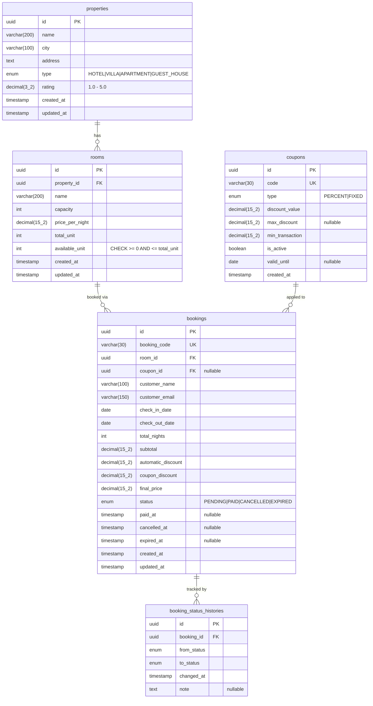

# Property Booking Platform Backend API

Backend API untuk platform pemesanan properti (seperti Traveloka, Airbnb, Tiket.com) yang dibangun dengan menggunakan **NestJS**, **TypeORM**, **PostgreSQL**, dan **Docker**.

---

## 🚀 Fitur Utama

- **Property & Room Management**: CRUD properti dan kamar dengan validasi class-validator yang ketat.
- **Listing & Filtering**: Filter properti berdasarkan kota, tipe, rating minimum, kapasitas kamar minimum, harga kamar maksimum, dan ketersediaan tanggal check-in/check-out.
- **Advanced Pagination**: Mendukung **Offset-based** dan **Cursor-based** pagination.
- **Transactional Booking Flow**: Alur pemesanan aman dari race conditions menggunakan **Pessimistic Write Locking** (`SELECT ... FOR UPDATE`).
- **Flexible Promotion Engine**:
  - Diskon otomatis: Menginap ≥ 3 malam mendapat potongan 10%.
  - Kupon: Kode `NEWUSER10` (potongan 10% hingga Rp 100.000, min. transaksi Rp 500.000) dan `STAYCATION50` (potongan tetap Rp 50.000, min. transaksi Rp 300.000).
- **Payment & Cancellation**: Proses pembayaran (`PAID`) dan pembatalan (`CANCELLED`) dengan pengembalian unit kamar secara otomatis.
- **Automatic Expiry (Cron)**: Cron job yang secara otomatis membatalkan booking `PENDING` jika tidak dibayar dalam waktu 1 jam.
- **Refund Flow**: Memungkinkan refund untuk pesanan yang sudah `PAID` (membatalkannya dan mengembalikan unit kamar).
- **Global Error Handling & Logging**: Respons kesalahan yang seragam dan pencatatan log terstruktur.

---

## 🛠️ Tech Stack

- **Framework**: NestJS (v11) & TypeScript (Strict Mode)
- **Database & ORM**: PostgreSQL 16 & TypeORM (Migration-driven)
- **Validation**: Joi (Env Vars) & Class-Validator (DTOs)
- **Monetary Safety**: `Decimal.js` (Menghindari IEEE 754 float arithmetic bug)
- **Docker**: Dockerfile multi-stage & Docker Compose

---

## 📐 Arsitektur Database & Reasoning



### Penjelasan Desain Tabel:
1. **`coupons`**: Kupon dirancang sebagai tabel data master, bukan di-hardcode di kode. Hal ini memungkinkan admin untuk menambah, menonaktifkan, atau mengubah masa kedaluwarsa kupon secara dinamis.
2. **`bookings`**: Menyimpan seluruh hasil perhitungan kalkulasi (`subtotal`, `automatic_discount`, `coupon_discount`, `final_price`) sebagai snapshot historis. Ini memastikan audit trail tetap konsisten meskipun harga kamar atau aturan kupon berubah di kemudian hari.
3. **`booking_status_histories`**: Berfungsi sebagai log/audit trail perubahan status booking (misalnya dari `PENDING` -> `PAID`, `PENDING` -> `EXPIRED`). Sangat berguna untuk tracking audit internal dan debugging masalah transaksi.

---

## 💸 Logika Perhitungan Promosi & Diskon

### Aturan Kalkulasi:
1. **Subtotal**: `price_per_night * total_nights`.
2. **Automatic Discount**: Jika `total_nights >= 3`, diskon 10% dihitung langsung dari `subtotal`.
3. **Subtotal Setelah Diskon Otomatis**: `subtotal - automatic_discount`.
4. **Kupon**: Validasi kupon dilakukan terhadap **Subtotal Setelah Diskon Otomatis**.
   - `min_transaction` kupon divalidasi terhadap nominal ini.
   - Jika kupon bertipe `PERCENT`, potongan dihitung dari nominal ini dan dibatasi oleh `max_discount` (seperti cap Rp 100.000 pada kupon `NEWUSER10`).
   - Jika kupon bertipe `FIXED`, potongan nominal tetap diaplikasikan langsung.
5. **Final Price**: `subtotal - automatic_discount - coupon_discount` (Hasil akhir dipastikan tidak kurang dari 0).

---

## 🔒 Strategi Konkurensi & Optimasi Query

### 1. Concurrency Control (Race Condition Prevention)
Untuk mencegah overbooking ketika beberapa pelanggan mencoba memesan 1 unit kamar yang tersisa secara bersamaan, aplikasi menerapkan **Pessimistic Write Locking** (`SELECT ... FOR UPDATE`):
- Transaksi database dimulai.
- Baris data kamar di-query menggunakan lock:
  ```typescript
  const room = await manager
    .createQueryBuilder(Room, 'room')
    .setLock('pessimistic_write')
    .where('room.id = :id', { id: roomId })
    .getOne();
  ```
- Ini memblokir transaksi lain yang ingin membaca/mengubah baris kamar tersebut hingga transaksi saat ini selesai (`COMMIT` atau `ROLLBACK`).
- Guard level database (`unsigned integer` atau `available_unit >= 0`) memastikan integritas data tetap terjaga.

### 2. Pencegahan N+1 Query & Strategi Index
- Di endpoint listing properti, semua data kamar di-join menggunakan `leftJoinAndSelect` sehingga relasi ditarik dalam satu kali query SQL saja.
- **Index Strategis** dipasang pada kolom filter utama:
  - `properties`: `(city, type)` untuk filter gabungan dan `(rating)` untuk penyortiran.
  - `rooms`: `(property_id)` untuk foreign key join speed, `(price_per_night)` dan `(capacity)` untuk filter rentang.
  - `bookings`: `(booking_code)` UNIQUE index, `(room_id, status)` untuk subquery ketersediaan kamar, dan `(status, expired_at)` untuk efisiensi query cron job pembatalan otomatis.

---

## 📄 Offset vs Cursor-based Pagination

| Aspek | Offset Pagination (`page` & `limit`) | Cursor Pagination (`cursor` & `limit`) |
|---|---|---|
| **Kinerja Skala Besar** | Lambat pada halaman akhir karena DB harus memindai semua baris sebelumnya (`OFFSET X`). | Selalu cepat dan stabil karena langsung mengarah ke baris setelah cursor (`WHERE id > X`). |
| **Konsistensi Data** | Rentan terhadap duplikasi atau data terlewat jika baris data baru dimasukkan saat user membolak-balik halaman. | Sangat konsisten untuk real-time data feed (seperti infinite scroll) karena tidak bergantung pada posisi halaman statis. |
| **Navigasi Acak** | Mudah melompat ke halaman mana saja (misalnya halaman 5). | Hanya mendukung navigasi berurutan (Next/Previous). |

---

## ⚙️ Petunjuk Pemasangan & Pengoperasian

### 🐳 Menjalankan Menggunakan Docker (Rekomendasi)
Pastikan Docker dan Docker Compose sudah terpasang dan berjalan di sistem Anda:

1. Buat file `.env` (salin dari `.env.example`):
   ```bash
   cp .env.example .env
   ```
2. Jalankan docker-compose:
   ```bash
   docker compose up -d
   ```
3. Lakukan migrasi database dan seed data awal:
   ```bash
   docker compose exec api npm run migration:run
   docker compose exec api npm run seed
   ```
4. API berjalan di: `http://localhost:3000/api`
5. Swagger API Docs: `http://localhost:3000/api/docs`

### 💻 Menjalankan Secara Lokal (Local Environment)
1. Pasang dependensi project:
   ```bash
   npm install
   ```
2. Sesuaikan konfigurasi PostgreSQL lokal Anda di `.env`.
3. Jalankan migrasi database:
   ```bash
   npm run migration:run
   ```
4. Jalankan seed data awal:
   ```bash
   npm run seed
   ```
5. Jalankan aplikasi dalam mode development:
   ```bash
   npm run start:dev
   ```
6. Jalankan unit test:
   ```bash
   npm run test
   ```

---

## 📌 Contoh Request & Response (Main Flows)

### 1. Get Properties (Dengan Filter & Tanggal Ketersediaan)

**Request:**
```bash
curl -X GET "http://localhost:3000/api/properties?city=Jakarta&minRating=4.0&checkInDate=2026-07-20&checkOutDate=2026-07-22"
```

**Response (200 OK):**
```json
{
  "success": true,
  "data": {
    "data": [
      {
        "id": 1,
        "name": "Grand Hyatt Jakarta",
        "city": "Jakarta",
        "address": "Jl. MH Thamrin No.28-30, Jakarta Pusat",
        "type": "HOTEL",
        "rating": 4.8,
        "rooms": [
          {
            "id": 1,
            "name": "Deluxe Room",
            "capacity": 2,
            "pricePerNight": 1500000,
            "totalUnit": 10,
            "availableUnit": 8
          },
          {
            "id": 2,
            "name": "Suite Room",
            "capacity": 4,
            "pricePerNight": 3500000,
            "totalUnit": 5,
            "availableUnit": 5
          }
        ]
      }
    ],
    "meta": {
      "total": 1,
      "page": 1,
      "limit": 10,
      "totalPages": 1
    }
  }
}
```

---

### 2. Create Booking (Dengan Kupon NEWUSER10)

**Request:**
```bash
curl -X POST "http://localhost:3000/api/bookings" \
  -H "Content-Type: application/json" \
  -d '{
    "customerName": "John Doe",
    "customerEmail": "john.doe@example.com",
    "roomId": 1,
    "checkInDate": "2026-07-20",
    "checkOutDate": "2026-07-23",
    "couponCode": "NEWUSER10"
  }'
```

**Response (201 Created):**
```json
{
  "success": true,
  "data": {
    "id": 1,
    "bookingCode": "BK-20260720-A1B2C3D4",
    "roomId": 1,
    "couponId": 1,
    "customerName": "John Doe",
    "customerEmail": "john.doe@example.com",
    "checkInDate": "2026-07-20",
    "checkOutDate": "2026-07-23",
    "totalNights": 3,
    "subtotal": 4500000,
    "automaticDiscount": 450000,
    "couponDiscount": 100000,
    "finalPrice": 3950000,
    "status": "PENDING",
    "createdAt": "2026-07-17T14:30:00.000Z"
  }
}
```

> **Penjelasan Kalkulasi:**
> - Subtotal: 1.500.000 × 3 malam = **4.500.000**
> - Automatic discount (≥3 malam → 10%): 4.500.000 × 10% = **450.000**
> - Subtotal setelah diskon otomatis: 4.500.000 - 450.000 = **4.050.000**
> - Kupon NEWUSER10 (10%, max 100.000): 4.050.000 × 10% = 405.000 → cap **100.000**
> - Final price: 4.050.000 - 100.000 = **3.950.000**

---

### 3. Selesaikan Pembayaran Booking (Mark as Paid)

**Request:**
```bash
curl -X PATCH "http://localhost:3000/api/bookings/1/pay"
```

**Response (200 OK):**
```json
{
  "success": true,
  "data": {
    "id": 1,
    "bookingCode": "BK-20260720-A1B2C3D4",
    "roomId": 1,
    "couponId": 1,
    "customerName": "John Doe",
    "customerEmail": "john.doe@example.com",
    "checkInDate": "2026-07-20",
    "checkOutDate": "2026-07-23",
    "totalNights": 3,
    "subtotal": 4500000,
    "automaticDiscount": 450000,
    "couponDiscount": 100000,
    "finalPrice": 3950000,
    "status": "PAID",
    "createdAt": "2026-07-17T14:30:00.000Z"
  }
}
```

---

### 4. Cancel Booking (Restore Unit Kamar)

**Request:**
```bash
curl -X PATCH "http://localhost:3000/api/bookings/2/cancel"
```

**Response (200 OK):**
```json
{
  "success": true,
  "data": {
    "id": 2,
    "bookingCode": "BK-20260720-E5F6G7H8",
    "roomId": 1,
    "couponId": null,
    "customerName": "Jane Smith",
    "customerEmail": "jane.smith@example.com",
    "checkInDate": "2026-07-25",
    "checkOutDate": "2026-07-26",
    "totalNights": 1,
    "subtotal": 1500000,
    "automaticDiscount": 0,
    "couponDiscount": 0,
    "finalPrice": 1500000,
    "status": "CANCELLED",
    "createdAt": "2026-07-17T14:35:00.000Z"
  }
}
```

---

### 5. Refund Booking (Bonus: Cancel PAID Booking)

**Request:**
```bash
curl -X PATCH "http://localhost:3000/api/bookings/1/refund"
```

**Response (200 OK):**
```json
{
  "success": true,
  "data": {
    "id": 1,
    "bookingCode": "BK-20260720-A1B2C3D4",
    "roomId": 1,
    "couponId": 1,
    "customerName": "John Doe",
    "customerEmail": "john.doe@example.com",
    "checkInDate": "2026-07-20",
    "checkOutDate": "2026-07-23",
    "totalNights": 3,
    "subtotal": 4500000,
    "automaticDiscount": 450000,
    "couponDiscount": 100000,
    "finalPrice": 3950000,
    "status": "CANCELLED",
    "createdAt": "2026-07-17T14:30:00.000Z"
  }
}
```

---

### 6. Contoh Error Responses

**Invalid Coupon Code (404 Not Found):**
```bash
curl -X POST "http://localhost:3000/api/bookings" \
  -H "Content-Type: application/json" \
  -d '{ "customerName": "Test", "customerEmail": "test@mail.com", "roomId": 1, "checkInDate": "2026-08-01", "checkOutDate": "2026-08-02", "couponCode": "INVALID_CODE" }'
```
```json
{
  "success": false,
  "statusCode": 404,
  "message": "Coupon code INVALID_CODE not found",
  "timestamp": "2026-07-17T14:40:00.000Z",
  "path": "/api/bookings"
}
```

**Minimum Transaction Not Met (422 Unprocessable Entity):**
```json
{
  "success": false,
  "statusCode": 422,
  "message": "Minimum transaction of 500000 is required to use coupon NEWUSER10",
  "timestamp": "2026-07-17T14:41:00.000Z",
  "path": "/api/bookings"
}
```

**Cancel PAID Booking (409 Conflict):**
```bash
curl -X PATCH "http://localhost:3000/api/bookings/1/cancel"
```
```json
{
  "success": false,
  "statusCode": 409,
  "message": "Cannot cancel booking with status PAID. Paid bookings cannot be cancelled.",
  "timestamp": "2026-07-17T14:42:00.000Z",
  "path": "/api/bookings/1/cancel"
}
```

**Room Unavailable / Overbooking (409 Conflict):**
```json
{
  "success": false,
  "statusCode": 409,
  "message": "No available units for this room type",
  "timestamp": "2026-07-17T14:43:00.000Z",
  "path": "/api/bookings"
}
```

**Validation Error (400 Bad Request):**
```bash
curl -X POST "http://localhost:3000/api/bookings" \
  -H "Content-Type: application/json" \
  -d '{ "customerName": "", "roomId": 1 }'
```
```json
{
  "success": false,
  "statusCode": 400,
  "message": [
    "customerName should not be empty",
    "customerEmail must be an email",
    "checkInDate must be a valid ISO 8601 date string",
    "checkOutDate must be a valid ISO 8601 date string"
  ],
  "timestamp": "2026-07-17T14:44:00.000Z",
  "path": "/api/bookings"
}
```

